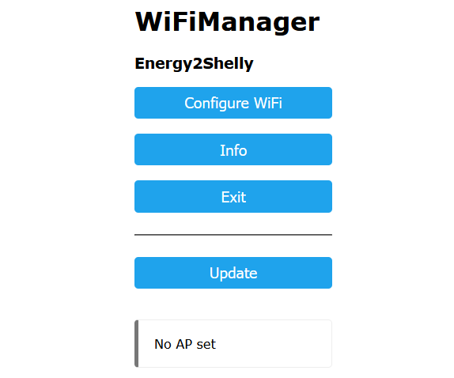
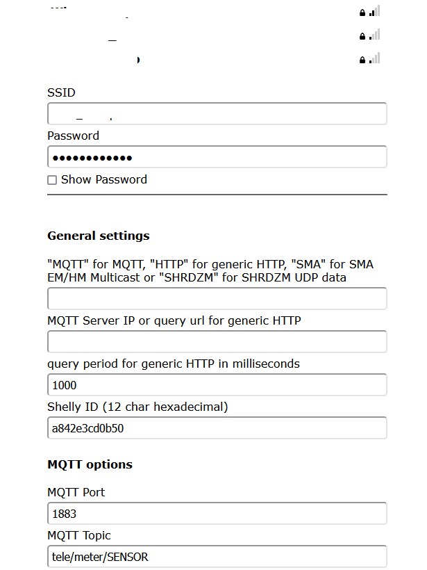
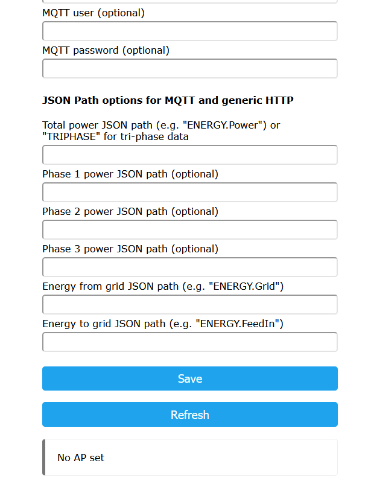
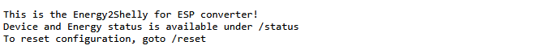
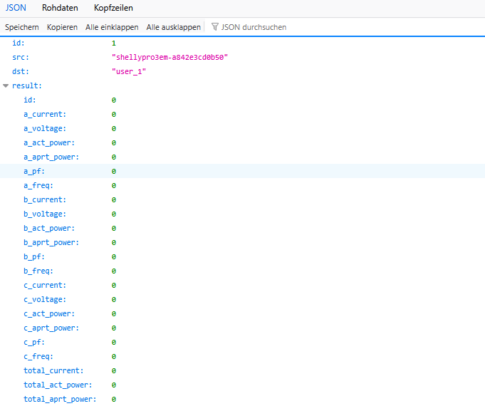

# Energy2Shelly_ESP

### Getting started
This is a Shelly Pro 3EM Emulator running on ESP8266 or ESP32 to using various input sources for power data. 
This can be used for zero feed-in with Hoymiles MS-A2 (and in the near future Marstek Venus).

Kudos to @sdeigms excellent work at https://github.com/sdeigm/uni-meter which made this port easily possible. 
SMA Multicast code is based on https://www.mikrocontroller.net/topic/559607

# Installation
1) compile for your microcontrollers
2) flashing and power up (it opens a hotspot named "Energy2Shelly")
3) running WifiManager for intial WiFi setup and further configuration

  ### On the captive portal you can currently enter:
  - <code>MQTT</code>
    - Server IP, port and topic; power values on the MQTT topic are expected in JSON format. The are multiple fields to define the available values using a JSON Path-style syntax, e.g. <code>energy.data</code> for <code>{"energy":{"data":mypowervalue}}</code>. 
  You can also select between monophase and triphase power data.
  - <code>SMA</code>
    - SMA Energy Meter or Home Manager UDP multicast data
  - <code>SHRDZM</code>
      - SHRDZM smart meter interface (common in Austria) with UDP unicast data; please enable UDP broadcasts to the IP of the ESP and port 9522 within SHRDZM
  - <code>HTTP</code>
      - a generic HTTP input; enter a query URL in the second parameter field which delivers JSON data and define at least the JSON Path for total power
  
  ### Here are some sample generic HTTP query paths for common devices:
  - Fronius: <code>http://IP-address/solar_api/v1/GetMeterRealtimeData.cgi?Scope=System</code>
  - Tasmota devices: <code>http://IP-address/cm?cmnd=status%2010</code>
  - ioBroker datapoints: <code>http://IP-address:8082/getBulk/smartmeter.0.1-0:1_8_0__255.value,smartmeter.0.1-0:2_8_0__255.value,smartmeter.0.1-0:16_7_0__255.value/?json</code>
  
  The Shelly ID defaults to the ESP's MAC address, you may change this if you want to substitute an existing uni-meter configuration without reconnecting the battery to a new shelly device.
  
4) Check if your device is visible in the WLAN. <code>http://IP-address</code> 
5) Check the current power data at <code>http://IP-address/status</code> 
- [ ] \(Optional) If you want to reset you Wifi-Configuration and/or reconfigure other settings go to <code>http://IP-address/reset</code> and reconnect to the Energy2Shelly hotspot.

# Tested microcontrollers
* ESP32 (ESP32-WROOM-32)
* ESP8266

# You found a bug
First, sorry. This software is not perfect.
1. Open a issue
-With helpful title - use descriptive keywords in the title and body so others can find your bug (avoiding duplicates).
- Which branch, what microcontroller, what setup
- Steps to reproduce the problem, with actual vs. expected results
- If you find a bug in our code, post the files and the lines.
 
 

# some screenshots from project
  

  ### Settings
  
  

  ### main page <code>http://IP-address</code>
  

  ### status page <code>http://IP-address/status</code>
  

  > [!NOTE]
> Images may vary depending on the version. We always try to be up to date.
